# 🚀 Atlas - Ride-Hailing Microservices Platform

> A production-ready, event-driven microservices architecture built with Go, demonstrating distributed systems patterns, real-time location tracking, and financial transaction consistency.

**Status:** ✅ Production-Ready MVP | **Portfolio Project**  
**Author:** Dwiki Kusuma | **Date:** December 2025

---

## 📋 Table of Contents

- [Overview](#overview)
- [Architecture Highlights](#architecture-highlights)
- [Service Mesh Overview](#service-mesh-overview)
- [Core Services](#core-services)
- [System Flow](#system-flow)
- [Design Patterns & Learning Journey](#design-patterns--learning-journey)
- [Technology Stack](#technology-stack)
- [Getting Started](#getting-started)
- [API Documentation](#api-documentation)
- [Key Implementation Details](#key-implementation-details)
- [Future Enhancements](#future-enhancements)

---

## 🎯 Overview

**Atlas** is a fully functional ride-hailing platform backend that demonstrates modern microservices architecture principles. Built as a solo learning project, it showcases enterprise-grade patterns including event-driven architecture, CQRS, saga patterns, and distributed transaction management.

### What This Project Demonstrates

- ✅ **Microservices Architecture** with 5+ independent services
- ✅ **Event-Driven Communication** using Apache Kafka
- ✅ **Real-time Geospatial Operations** with Redis
- ✅ **ACID Transactions** in distributed systems
- ✅ **gRPC** for high-performance service-to-service communication
- ✅ **RESTful API Gateway** pattern
- ✅ **Domain-Driven Design** with clean architecture
- ✅ **Graceful Shutdown** handling with WaitGroups
- ✅ **Test-Driven Development** with mocks

---

## 🏗️ Architecture Highlights

### Event-Driven Microservices

The system follows an **event-driven architecture** where services communicate asynchronously through Kafka topics, enabling:

- **Loose Coupling**: Services are independent and can evolve separately
- **Scalability**: Each service can be scaled horizontally based on load
- **Resilience**: Failures in one service don't cascade to others
- **Eventual Consistency**: Data synchronization through event streams

### Service Mesh Overview

```mermaid
graph TB
    subgraph "Client Layer"
        CUSTOMER["👤 Customer App<br/>Mobile/Web"]
        DRIVER["🚗 Driver App<br/>Mobile"]
    end
    
    subgraph "API Gateway Layer"
        GATEWAY["🌐 HTTP Gateway :8085<br/>- REST API<br/>- Request Routing<br/>- Load Balancing"]
    end
    
    subgraph "Service Layer (gRPC)"
        TRACKER["📍 Tracker Service :50051<br/>- Location Updates<br/>- Geospatial Queries<br/>- Driver Availability"]
        
        DISPATCH["🎯 Dispatch Service :50053<br/>- Driver Matching<br/>- Ride Requests<br/>- Event Publishing"]
        
        ORDER["📋 Order Service :50052<br/>- Ride Lifecycle<br/>- State Machine<br/>- Order Management"]
        
        WALLET["🏦 Wallet Service :50054<br/>- Balance Management<br/>- Transactions<br/>- Payment Processing"]
    end
    
    subgraph "Event Bus"
        KAFKA["📨 Apache Kafka<br/>Topics:<br/>• driver-gps<br/>• ride-dispatch<br/>• wallet-transactions"]
    end
    
    subgraph "Data Layer"
        REDIS["📊 Redis<br/>- Geospatial Index<br/>- GEOADD/GEORADIUS<br/>- Driver Locations"]
        
        POSTGRES["🗄️ PostgreSQL<br/>- Orders DB<br/>- Wallet DB<br/>- ACID Transactions"]
    end
    
    CUSTOMER -->|HTTPS| GATEWAY
    DRIVER -->|HTTPS| GATEWAY
    
    GATEWAY -->|gRPC| TRACKER
    GATEWAY -->|gRPC| DISPATCH
    GATEWAY -->|gRPC| ORDER
    GATEWAY -->|gRPC| WALLET
    
    DISPATCH -->|gRPC Query| TRACKER
    
    TRACKER -->|Publish Events| KAFKA
    DISPATCH -->|Publish Events| KAFKA
    ORDER -->|Publish Events| KAFKA
    
    TRACKER -->|Consume Events| KAFKA
    ORDER -->|Consume Events| KAFKA
    WALLET -->|Consume Events| KAFKA
    
    TRACKER -->|GEOADD<br/>GEORADIUS| REDIS
    ORDER -->|CRUD| POSTGRES
    WALLET -->|ACID Tx| POSTGRES
    
    style GATEWAY fill:#e1f5ff
    style KAFKA fill:#fff3e0
    style REDIS fill:#ffebee
    style POSTGRES fill:#f3e5f5
```



### Data Flow Architecture

The platform implements multiple data flow patterns:

1. **Synchronous (gRPC)**: Gateway → Services for immediate responses
2. **Asynchronous (Kafka)**: Services → Services for eventual consistency
3. **Pub/Sub**: Location updates, ride matching, payment triggers
4. **Request-Response**: API calls requiring immediate feedback

---

## 🔧 Core Services

### 1. 🌐 Gateway Service (Port 8085)

**Purpose**: Single entry point for all client applications, providing a RESTful HTTP API.

**Key Responsibilities**:
- Request routing to appropriate backend services
- Protocol translation (HTTP ↔ gRPC)
- Response aggregation from multiple services
- Authentication/Authorization (future enhancement)

**Implementation Highlights**:
```go
// Concurrent service calls using WaitGroup
type CustomerHandler struct {
    order    order.OrderServiceClient
    dispatch dispatch.DispatchServiceClient
}

// Graceful JSON response handling
func writeJSON(w http.ResponseWriter, status int, data any) {
    w.Header().Set("Content-Type", "application/json")
    w.WriteHeader(status)
    json.NewEncoder(w).Encode(data)
}
```

**API Endpoints**:
- `POST /customer/order` - Create ride order
- `POST /customer/ride/request` - Request driver
- `GET /customer/order` - Get order status
- `POST /driver/location` - Update driver location
- `PUT /driver/order/status` - Update ride status

**Pattern**: API Gateway + Aggregator

---

### 2. 📍 Tracker Service (Port 50051)

**Purpose**: High-throughput location tracking with geospatial queries.

**Architecture Pattern**: CQRS (Command Query Responsibility Segregation)

**Write Path (Command)**:
```go
func (s *Server) UpdateLocation(ctx context.Context, req *UpdateLocationRequest) {
    // Publish to Kafka for async processing
    event := model.LocationEvent{...}
    s.producer.Publish(ctx, "driver-gps", userId, eventBytes)
}
```

**Read Path (Query)**:
```go
func (s *Server) GetNearbyDrivers(ctx context.Context, req *GetNearbyDriverRequest) {
    // Direct Redis query for low latency
    drivers := s.repo.GetNearbyDrivers(ctx, lat, lon, radius)
}
```

**Worker (Background Processing)**:
```go
func (w *IngestionWorker) Run(ctx context.Context) {
    for {
        msg := w.consumer.FetchMessage(ctx)
        event := unmarshal(msg.Value)
        
        // Persist to Redis with geospatial indexing
        w.repo.UpdatePosition(ctx, event.UserID, event.Lat, event.Lon)
        
        w.consumer.CommitMessages(ctx, msg)
    }
}
```

**Key Technologies**:
- **Redis GEOADD**: O(log(N)) insertion into sorted set
- **Redis GEORADIUS**: Efficient spatial queries
- **Kafka Consumer**: Asynchronous location persistence

**Why This Architecture?**
- **Write Scalability**: Kafka absorbs write spikes
- **Read Performance**: Redis provides sub-millisecond queries
- **Decoupling**: gRPC handler doesn't block on Redis writes

---

### 3. 🎯 Dispatch Service (Port 50053)

**Purpose**: Intelligent driver-customer matching engine.

**Matching Algorithm**:
```go
func (s *DispatchService) RequestRide(ctx context.Context, req *RequestRideRequest) {
    // 1. Query nearby drivers from Tracker
    drivers := s.trackerClient.GetNearbyDrivers(ctx, &tracker.GetNearbyDriverRequest{
        Latitude:  req.PickupLat,
        Longitude: req.PickupLong,
        Radius:    5.0, // 5km radius
    })
    
    // 2. Select closest available driver
    if len(drivers) > 0 {
        selectedDriver := drivers[0] // Already sorted by distance
        
        // 3. Publish RideDispatchedEvent to Kafka
        event := RideDispatchedEvent{
            RideID:   req.PassengerId,
            DriverID: selectedDriver.Id,
            ...
        }
        s.producer.Publish(ctx, "ride-dispatch", event)
    }
}
```

**Pattern**: Orchestrator (Saga Pattern)

**Responsibilities**:
1. Coordinates driver discovery
2. Implements matching logic
3. Publishes dispatch events
4. Returns immediate response to customer

---

### 4. 📋 Order Service (Port 50052)

**Purpose**: Ride lifecycle state machine and order management.

**State Machine**:
```
CREATED → MATCHED → STARTED → FINISHED
```

**Implementation**:
```go
// Synchronous order creation
func (s *Service) CreateOrder(ctx context.Context, req *CreateOrderRequest) {
    order := s.store.CreateOrder(ctx, db.CreateOrderParams{
        PassengerID: req.UserId,
        Status:      "CREATED",
        Price:       calculatePrice(req), // Haversine formula
    })
    return &CreateOrderResponse{OrderId: order.ID}
}

// Asynchronous driver assignment
type OrderWorker struct {
    consumer kafka.EventConsumer
    store    db.Querier
}

func (w *OrderWorker) Start(ctx context.Context) {
    for {
        msg := w.consumer.FetchMessage(ctx)
        event := unmarshal(msg.Value) // RideDispatchedEvent
        
        // Update order with assigned driver
        w.store.UpdateOrderDriver(ctx, db.UpdateOrderDriverParams{
            ID:       event.RideID,
            DriverID: event.DriverID,
        })
        
        w.consumer.CommitMessages(ctx, msg)
    }
}
```

**Payment Flow (Async Decoupling)**:
```go
func (s *Service) UpdateOrderStatus(ctx context.Context, req *UpdateOrderStatusRequest) {
    // Update ride status
    s.store.UpdateOrderStatus(ctx, req.OrderId, req.Status)
    
    // If ride finished, trigger payment asynchronously
    if req.Status == "FINISHED" {
        order := s.store.GetOrder(ctx, req.OrderId)
        
        debitEvent := DebitBalanceEvent{
            UserID:    order.PassengerID,
            Amount:    order.Price,
            Reference: order.ID,
        }
        
        // Publish to Kafka - don't block on payment
        s.producer.Publish(ctx, "wallet-transactions", debitEvent)
    }
}
```

**Pattern**: Event Sourcing + Transactional Outbox

**Key Features**:
- **State Validation**: Prevents invalid transitions
- **Idempotency**: Kafka message keys prevent duplicates
- **Async Payment**: Ride completion doesn't wait for payment

---

### 5. 🏦 Wallet Service (Port 50054)

**Purpose**: Financial ledger with ACID guarantees.

**Double-Entry Ledger Architecture**:

```sql
-- Snapshot table (current state)
CREATE TABLE wallets (
    user_id VARCHAR(50) PRIMARY KEY,
    balance DOUBLE PRECISION NOT NULL,
    updated_at TIMESTAMPTZ NOT NULL
);

-- Append-only log (audit trail)
CREATE TABLE transactions (
    id UUID PRIMARY KEY,
    wallet_id VARCHAR(50) REFERENCES wallets(user_id),
    amount DOUBLE PRECISION NOT NULL, -- negative = debit
    description TEXT,
    reference_id VARCHAR(50), -- links to order
    created_at TIMESTAMPTZ NOT NULL
);
```

**ACID Transaction Implementation**:
```go
func (s *PostgresWalletService) DebitBalance(ctx context.Context, req *DebitBalanceRequest) {
    var newBalance float64
    
    // Start transaction
    err := s.execTx(ctx, func(q *db.Queries) error {
        // 1. Verify wallet exists
        wallet := q.GetWallet(ctx, req.UserId)
        
        // 2. Insert transaction record (audit trail)
        q.CreateTransaction(ctx, db.CreateTransactionParams{
            WalletID:    req.UserId,
            Amount:      -req.Amount, // Negative for debit
            Description: "DEBIT",
            ReferenceID: req.ReferenceId,
        })
        
        // 3. Update balance atomically with row-level lock
        wallet = q.AddWalletBalance(ctx, db.AddWalletBalanceParams{
            UserID: req.UserId,
            Amount: -req.Amount,
        })
        
        newBalance = wallet.Balance
        return nil // Commit
    })
    
    return &BalanceResponse{NewBalance: newBalance}
}
```

**Payment Worker (Kafka Consumer)**:
```go
func (w *WalletWorker) Start(ctx context.Context) {
    for {
        msg := w.consumer.FetchMessage(ctx)
        event := unmarshal(msg.Value) // DebitBalanceEvent
        
        // Validate event data
        if event.UserID == "" || event.Amount <= 0 {
            // Poison pill protection - commit bad message
            w.consumer.CommitMessages(ctx, msg)
            continue
        }
        
        // Process payment with timeout
        debitCtx, cancel := context.WithTimeout(ctx, 10*time.Second)
        _, err := w.service.DebitBalance(debitCtx, &wallet.DebitBalanceRequest{
            UserId:      event.UserID,
            Amount:      event.Amount,
            ReferenceId: event.Reference,
        })
        cancel()
        
        if err != nil {
            // Don't commit - allow retry on restart
            log.Printf("Payment failed: %v", err)
            continue
        }
        
        // Success - commit offset
        w.consumer.CommitMessages(ctx, msg)
    }
}
```

**Pattern**: Ledger + ACID Transactions + Event-Driven Processing

**Concurrency Control**:
- **Row-Level Locking**: `UPDATE ... RETURNING` in Postgres
- **Optimistic Concurrency**: Balance check before debit
- **Idempotency**: Reference ID prevents duplicate charges

**Poison Pill Handling**:
- Malformed JSON → Commit and skip
- Invalid data → Commit and skip
- Database errors → Don't commit, allow retry

---

## 🔄 System Flow

### Complete Ride Request Flow

```
┌──────────────────────────────────────────────────────────────────┐
│ Phase 1: Customer Requests Ride                                  │
└──────────────────────────────────────────────────────────────────┘

Customer App
    │
    │ POST /customer/order
    ▼
HTTP Gateway :8085
    │
    │ gRPC CreateOrder()
    ▼
Order Service :50052
    │
    │ INSERT INTO orders (status='CREATED', price=calculated)
    ▼
PostgreSQL
    │
    ◄─── Response: {order_id, status, price}
    │
Customer App

┌──────────────────────────────────────────────────────────────────┐
│ Phase 2: Driver Matching (Async)                                 │
└──────────────────────────────────────────────────────────────────┘

Customer App
    │
    │ POST /customer/ride/request
    ▼
HTTP Gateway :8085
    │
    │ gRPC RequestRide()
    ▼
Dispatch Service :50053
    │
    │ gRPC GetNearbyDrivers(lat, lon, radius=5km)
    ▼
Tracker Service :50051
    │
    │ GEORADIUS atlas:tracker:positions 5 km ASC
    ▼
Redis
    │
    ◄─── [{driver_1, distance: 0.5km}, {driver_2, distance: 1.2km}]
    │
Dispatch Service :50053
    │
    │ SELECT driver_1 (closest)
    │ Publish RideDispatchedEvent to Kafka
    ▼
Kafka Topic: ride-dispatch
    │
    │ [Background Worker Consuming]
    ▼
Order Service Worker
    │
    │ UPDATE orders SET driver_id='driver_1', status='MATCHED'
    ▼
PostgreSQL

┌──────────────────────────────────────────────────────────────────┐
│ Phase 3: Driver Updates Location (Real-time)                     │
└──────────────────────────────────────────────────────────────────┘

Driver App (every 5 seconds)
    │
    │ POST /driver/location {lat, lon}
    ▼
HTTP Gateway :8085
    │
    │ gRPC UpdateLocation()
    ▼
Tracker Service :50051
    │
    │ Publish LocationEvent to Kafka
    ▼
Kafka Topic: driver-gps
    │
    │ [Background Worker Consuming]
    ▼
Tracker Ingestion Worker
    │
    │ GEOADD atlas:tracker:positions lon lat driver_id
    ▼
Redis (Geospatial Index Updated)

┌──────────────────────────────────────────────────────────────────┐
│ Phase 4: Ride Lifecycle Updates                                  │
└──────────────────────────────────────────────────────────────────┘

Driver App
    │
    │ PUT /driver/order/status {status='STARTED'}
    ▼
Order Service :50052
    │
    │ UPDATE orders SET status='STARTED'
    ▼
PostgreSQL

    ... (ride in progress) ...

Driver App
    │
    │ PUT /driver/order/status {status='FINISHED'}
    ▼
Order Service :50052
    │
    │ UPDATE orders SET status='FINISHED'
    │ Calculate final fare
    │ Publish DebitBalanceEvent to Kafka
    ▼
Kafka Topic: wallet-transactions
    │
    │ [Background Worker Consuming]
    ▼
Wallet Service Worker
    │
    │ BEGIN TRANSACTION
    │   INSERT INTO transactions (amount=-fare, ref=order_id)
    │   UPDATE wallets SET balance = balance - fare
    │ COMMIT TRANSACTION
    ▼
PostgreSQL
```

---

## 📚 Design Patterns & Learning Journey

This project was built as a **structured learning path** through distributed systems patterns. Each service demonstrates specific architectural concepts:

### ✅ Completed Patterns

| Service | Design Pattern | Go Fundamentals | Key Learning |
|---------|----------------|-----------------|--------------|
| **Tracker** | CQRS + Event Sourcing | Goroutines, Channels | Separating read/write paths for scalability |
| **Order** | Saga Pattern + State Machine | Context, WaitGroups | Managing distributed transactions |
| **Dispatch** | Orchestrator + Pub/Sub | gRPC clients, Error handling | Service coordination without tight coupling |
| **Gateway** | API Gateway + Aggregator | HTTP handlers, JSON marshaling | Single entry point pattern |
| **Wallet** | Ledger + ACID Transactions | Postgres transactions, Row locking | Financial consistency in distributed systems |

### 🔑 Key Implementation Details

#### 1. Graceful Shutdown Pattern

Every service implements proper shutdown handling:

```go
func main() {
    ctx, cancel := context.WithCancel(context.Background())
    defer cancel()
    
    var wg sync.WaitGroup
    
    // Start worker
    wg.Add(1)
    go func() {
        defer wg.Done()
        worker.Start(ctx) // Respects ctx.Done()
    }()
    
    // Start gRPC server
    wg.Add(1)
    go func() {
        defer wg.Done()
        grpcServer.Serve(listener)
    }()
    
    // Wait for SIGTERM/SIGINT
    quit := make(chan os.Signal, 1)
    signal.Notify(quit, os.Interrupt, syscall.SIGTERM)
    <-quit
    
    // Cancel context (stops workers)
    cancel()
    
    // Graceful gRPC shutdown with timeout
    stopped := make(chan struct{})
    go func() {
        grpcServer.GracefulStop()
        close(stopped)
    }()
    
    select {
    case <-stopped:
        log.Println("✅ Shutdown complete")
    case <-time.After(10 * time.Second):
        grpcServer.Stop() // Force stop
    }
    
    // Wait for all goroutines
    wg.Wait()
}
```

**Why This Matters**:
- Messages in-flight are completed before shutdown
- Database connections close cleanly
- No data loss during deployments

#### 2. Kafka Consumer Patterns

**At-Least-Once Delivery**:
```go
for {
    msg := consumer.FetchMessage(ctx)
    
    // Process message
    err := processMessage(msg)
    
    if isPermanentError(err) {
        // Poison pill - commit to skip
        consumer.CommitMessages(ctx, msg)
    } else if err != nil {
        // Transient error - don't commit, will retry
        continue
    }
    
    // Success - commit offset
    consumer.CommitMessages(ctx, msg)
}
```

**Poison Pill Protection**:
```go
// Invalid JSON - will never succeed
if json.Unmarshal(msg.Value, &event) != nil {
    consumer.CommitMessages(ctx, msg) // Skip it
    continue
}

// Invalid data - will never succeed
if event.Amount <= 0 {
    consumer.CommitMessages(ctx, msg) // Skip it
    continue
}

// Database timeout - might succeed later
if isDatabaseError(err) {
    // DON'T commit - allow retry
    continue
}
```

#### 3. Context Timeout Pattern

```go
// Worker context (respects shutdown)
func (w *WalletWorker) Start(ctx context.Context) {
    for {
        select {
        case <-ctx.Done():
            return // Clean shutdown
        default:
        }
        
        msg := w.consumer.FetchMessage(ctx)
        
        // Operation context (independent timeout)
        opCtx, cancel := context.WithTimeout(ctx, 10*time.Second)
        _, err := w.service.DebitBalance(opCtx, &req)
        cancel() // Always cleanup
        
        if ctx.Err() != nil {
            return // Parent cancelled during operation
        }
    }
}
```

#### 4. Double-Entry Ledger Pattern

```go
// Every financial operation creates TWO entries
func DebitBalance(amount float64) error {
    tx.Begin()
    
    // Entry 1: Transaction log (immutable audit trail)
    tx.CreateTransaction(TransactionParams{
        Amount:      -amount,
        Description: "DEBIT",
        ReferenceID: orderID,
    })
    
    // Entry 2: Balance update (mutable snapshot)
    tx.UpdateBalance(BalanceParams{
        UserID: userID,
        Amount: -amount, // balance = balance - amount
    })
    
    tx.Commit()
}
```

**Benefits**:
- **Auditability**: Every transaction is recorded
- **Reconciliation**: Can rebuild balances from transaction log
- **Debugging**: Full history of all financial operations

---

## 🛠️ Technology Stack

### Core Technologies

| Category | Technology | Purpose |
|----------|-----------|---------|
| **Language** | Go 1.25 | High-performance, concurrent services |
| **Service Communication** | gRPC | Type-safe, efficient RPC |
| **HTTP Server** | Go net/http | RESTful API gateway |
| **Message Queue** | Apache Kafka | Event streaming, async communication |
| **RDBMS** | PostgreSQL 15 | ACID transactions, orders & wallet |
| **Cache/Geospatial** | Redis 7 | Sub-ms location queries, GEOADD/GEORADIUS |
| **Code Generation** | protoc, SQLC | Type-safe gRPC & database code |

### Libraries & Tools

```go
// Database
"github.com/jackc/pgx/v5"        // PostgreSQL driver
"github.com/redis/go-redis/v9"   // Redis client

// Messaging
"github.com/segmentio/kafka-go"  // Kafka producer/consumer

// gRPC
"google.golang.org/grpc"         // gRPC framework
"google.golang.org/protobuf"     // Protocol buffers

// Testing
"github.com/stretchr/testify"    // Test assertions & mocks
```

### Infrastructure

- **Docker Compose**: Local development environment
- **PostgreSQL**: Orders and wallet data
- **Redis**: Driver location index
- **Kafka (KRaft mode)**: Event streaming without ZooKeeper
- **Kafka UI**: Message inspection and debugging

---

## 🚀 Getting Started

### Prerequisites

```bash
# Required
- Go 1.25+
- Docker & Docker Compose
- Make (optional, for shortcuts)

# Optional
- protoc (for regenerating gRPC code)
- sqlc (for regenerating database code)
```

### Quick Start

```bash
# 1. Clone repository
git clone https://github.com/dwikikusuma/atlas.git
cd atlas

# 2. Start infrastructure
make up
# OR
docker-compose up -d

# 3. Run database migrations
make migrate-up service=order
make migrate-up service=wallet

# 4. Start services (in separate terminals)
go run cmd/tracker/main.go    # :50051
go run cmd/order/main.go       # :50052
go run cmd/dispatch/main.go    # :50053
go run cmd/wallet/main.go      # :50054
go run cmd/gateway/main.go     # :8085

# 5. Access Kafka UI
open http://localhost:8080
```

### Project Structure

```
atlas/
├── cmd/                    # Service entry points
│   ├── gateway/           # HTTP API gateway
│   ├── tracker/           # Location service
│   ├── order/             # Order management
│   ├── dispatch/          # Driver matching
│   └── wallet/            # Payment service
├── internal/              # Private application code
│   ├── gateway/
│   │   ├── handler.go     # HTTP handlers
│   │   ├── passenger.go   # Customer endpoints
│   │   └── driver.go      # Driver endpoints
│   ├── tracker/
│   │   ├── domain/        # Repository interfaces
│   │   ├── repository/    # Redis implementation
│   │   └── service/       # gRPC server & worker
│   ├── order/
│   │   ├── db/            # SQLC generated code
│   │   └── service/       # Business logic & worker
│   ├── dispatch/
│   │   ├── model/         # Event models
│   │   └── service/       # Matching logic
│   └── wallet/
│       ├── db/            # SQLC generated code
│       └── service/       # Ledger implementation
├── pkg/                   # Shared libraries
│   ├── kafka/            # Producer/consumer wrappers
│   ├── database/         # Postgres & Redis clients
│   ├── pb/               # Generated protobuf code
│   └── model/            # Shared event models
├── api/proto/            # gRPC service definitions
├── docker-compose.yml    # Infrastructure setup
└── Makefile             # Build & migration commands
```

---

## 📡 API Documentation

### Customer Endpoints

#### Create Order
```http
POST http://localhost:8085/customer/order
Content-Type: application/json

{
  "user_id": "customer-123",
  "pickup_long": 106.8456,
  "pickup_lat": -6.2088,
  "dropoff_long": 106.8650,
  "dropoff_lat": -6.2300
}

Response:
{
  "order_id": "550e8400-e29b-41d4-a716-446655440000",
  "status": "CREATED",
  "price": 25000
}
```

#### Request Ride
```http
POST http://localhost:8085/customer/ride/request
Content-Type: application/json

{
  "passenger_id": "customer-123",
  "pickup_long": 106.8456,
  "pickup_lat": -6.2088,
  "dropoff_long": 106.8650,
  "dropoff_lat": -6.2300,
  "vehicle_type": "go-ride"
}

Response:
{
  "ride_id": "customer-123",
  "status": "DRIVERS_FOUND",
  "driver_id": "driver-456"
}
```

#### Get Order Status
```http
GET http://localhost:8085/customer/order?id=550e8400-e29b-41d4-a716-446655440000

Response:
{
  "order_id": "550e8400-e29b-41d4-a716-446655440000",
  "passenger_id": "customer-123",
  "driver_id": "driver-456",
  "status": "MATCHED",
  "price": 25000,
  "created_at": "2025-12-15T10:30:00Z"
}
```

### Driver Endpoints

#### Update Location
```http
POST http://localhost:8085/driver/location
Content-Type: application/json

{
  "user_id": "driver-456",
  "latitude": -6.2088,
  "longitude": 106.8456,
  "timestamp": "2025-12-15T10:30:00Z"
}

Response:
{
  "success": true
}
```

#### Update Ride Status
```http
PUT http://localhost:8085/driver/order/status
Content-Type: application/json

{
  "order_id": "550e8400-e29b-41d4-a716-446655440000",
  "status": "STARTED"
}

Response:
{
  "order_id": "550e8400-e29b-41d4-a716-446655440000",
  "status": "STARTED",
  "updated_at": "2025-12-15T10:35:00Z"
}
```

---

## 🔮 Future Enhancements

### Phase 2: Advanced Features

- [ ] **History Service** (MongoDB)
    - Archive GPS logs and ride history
    - Worker pool pattern with buffered channels
    - Time-series data storage

- [ ] **Observability Stack**
    - Prometheus metrics
    - Grafana dashboards
    - Distributed tracing with Jaeger

- [ ] **Driver Credit System