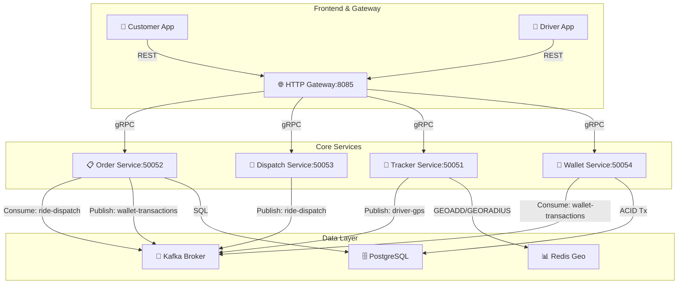

```
# 📡 Atlas Tracker Service

**Status:** 🎯 Core Microservices Complete | 🏦 Wallet Service (Debit MVP) Active  
**Date:** December 15, 2025

## ✅ Implemented Services

The Atlas platform operates on an event-driven microservices architecture with fully decoupled payment processing.

### 1. 🚗 Tracker Service (`gRPC: 50051`)
High-throughput driver location tracking with geospatial queries.

- **Location Ingestion:** gRPC handler accepts `UpdateLocation` requests from drivers  
- **Async Processing:** Kafka consumer (`driver-gps` topic) persists locations to Redis using `GEOADD`  
- **Nearby Search:** Redis `GEORADIUS` finds available drivers within 5 km  
- **Tech Stack:** Redis (geospatial), Kafka, gRPC

---

### 2. 📋 Order Service (`gRPC: 50052`)
End-to-end ride lifecycle management using a state machine.

- **Ride Lifecycle:** `CREATED` → `MATCHED` → `STARTED` → `FINISHED`  
- **Persistent Storage:** PostgreSQL with SQLC for type-safe operations  
- **Event-Driven:** Uses **Transactional Outbox** pattern via Kafka (`ride-dispatch` topic)  
- **Async Payment Trigger:** On ride completion, publishes `DebitBalanceEvent` to `wallet-transactions` topic  
- **Tech Stack:** PostgreSQL, Kafka, gRPC, SQLC

---

### 3. 🏦 Wallet Service (`gRPC: 50054`)
Central financial ledger enforcing consistency via double-entry accounting.

- **Ledger Architecture:** `wallets` (balance snapshots) + `transactions` (immutable log)  
- **ACID Compliance:** Row-level locking with `UPDATE ... RETURNING` in PostgreSQL transactions  
- **Payment Worker:** Kafka consumer processes `wallet-transactions` asynchronously  
- **Safety:** "Poison pill" handling for non-retryable errors (e.g., insufficient funds)  
- **Tech Stack:** PostgreSQL, Kafka (Consumer Group), gRPC

---

### 4. 🎯 Dispatch Service (`gRPC: 50053`)
Intelligent ride matching and coordination layer.

- **Ride Matching:** Queries nearby drivers from Tracker Service  
- **Event Publishing:** Emits `RideDispatchedEvent` to Kafka for async order updates  
- **Tech Stack:** gRPC, Kafka, HTTP gateway integration

---

### 5. 🌐 Gateway Service (`HTTP: 8085`)
Unified REST API for frontend clients.

- **Role:** Aggregates calls to internal gRPC services  
- **Tech Stack:** HTTP/JSON, gRPC clients

---

## 🔄 System Flow

### A. Ride Request (Happy Path)
```
Customer POST /customer/ride/request
↓
Gateway → Dispatch Service (RequestRide)
↓
Dispatch → Tracker (GetNearbyDrivers)
↓
Tracker → Redis (GEORADIUS within 5km)
↓
Dispatch → Kafka (Publish RideDispatchedEvent)
↓
Order Service → PostgreSQL (status: MATCHED)
↓
✅ Ride matched
```

### B. Payment Flow (Async & Decoupled)
```
Driver PUT /driver/order/status → FINISHED
↓
Order Service:
• Updates DB to FINISHED
• Calculates fare (Base + Distance)
• Publishes DebitBalanceEvent → Kafka (wallet-transactions)
↓
✅ Immediate 200 OK (Ride finished)

[Background]
Wallet Service:
• Consumes DebitBalanceEvent
• Starts DB transaction
• Debits passenger (with balance check)
• Logs ledger entry
• Commits transaction
```

---

## 🛠 Architecture Overview



## 📚 Learning Roadmap — Design Patterns

### ✅ Completed

| Service   | Design Pattern                     | Go Fundamental               |
|-----------|------------------------------------|------------------------------|
| Tracker   | Event-Driven (Kafka)               | Goroutines, Channels         |
| Order     | Transactional Outbox + State Machine | Database Transactions      |
| Dispatch  | Service Orchestration              | gRPC, Client Connections     |
| Gateway   | API Aggregation + Fan-Out          | `sync.WaitGroup`             |
| Wallet    | Async Event Processing             | Custom Worker Loops          |
| Wallet    | Ledger + ACID Transactions         | Row-Level Locking            |

### ⏸️ Backlog / Known Limitations

| Feature        | Status | Note                                                                 |
|----------------|--------|----------------------------------------------------------------------|
| Driver Credit  | Paused | Payments are debited from passengers but not yet credited to drivers |

### 🔮 Upcoming Features

1. **History Service (MongoDB)**
    - **Pattern:** Worker Pool + Buffered Channel
    - **Goal:** Archive GPS logs & ride history asynchronously
    - **Tech:** MongoDB, Worker Pool
    - **Focus:** Non-blocking writes, channel tuning

2. **Observability Stack**
    - **Goal:** Prometheus + Grafana dashboards for "Active Rides" and "Total Revenue"
```