# 📡 Atlas Tracker Service

**Status:** 🎯 Core Microservices Complete | 🚧 Wallet Service In Progress  
**Date:** December 13, 2025

## ✅ Implemented Services

The Atlas platform now has four core microservices fully functional, enabling end-to-end ride matching and tracking.

### 1. 🚗 Tracker Service (gRPC: 50051)
High-throughput driver location tracking with geospatial queries.
* **Location Ingestion:** gRPC handler accepts `UpdateLocation` requests from drivers.
* **Async Processing:** Kafka consumer (`driver-gps` topic) persists locations to Redis using `GEOADD` commands.
* **Nearby Search:** Redis `GEORADIUS` queries find available drivers within a 5km radius.
* **Tech Stack:** Redis (geospatial), Kafka (async), gRPC.

### 2. 📋 Order Service (gRPC: 50052)
End-to-end ride lifecycle management with state machine consistency.
* **Ride Lifecycle:** State transitions: `CREATED` → `MATCHED` → `STARTED` → `FINISHED`.
* **Persistent Storage:** PostgreSQL with SQLC for type-safe database operations.
* **Event-Driven Architecture:** Implements **Transactional Outbox** pattern via Kafka (`ride-dispatch` topic).
* **Driver Matching:** Kafka consumer listens for dispatch events and updates order status with assigned driver.
* **Tech Stack:** PostgreSQL, Kafka, gRPC, SQLC.

### 3. 🎯 Dispatch Service (gRPC: 50053)
Intelligent driver matching and ride request coordination.
* **Ride Request Handler:** Receives customer ride requests and queries nearby drivers from Tracker.
* **Driver Selection:** Selects the closest available driver (index 0 = nearest).
* **Event Publishing:** Publishes `RideDispatchedEvent` to Kafka for asynchronous order updates.
* **Response Handling:** Returns driver assignment status (`DRIVERS_FOUND` or `DRIVERS_NOT_FOUND`).
* **Tech Stack:** gRPC, Kafka, HTTP gateway communication.

### 4. 🌐 Gateway Service (HTTP: 8085)
API aggregation layer providing REST endpoints for customers and drivers.

**Customer Endpoints:**
* `POST /customer/order` - Create a new ride order.
* `POST /customer/ride/request` - Request a ride and trigger driver matching.
* `GET /customer/order?id={orderId}` - Retrieve order status and details.

**Driver Endpoints:**
* `POST /driver/location` - Update driver's current location (triggers Tracker service).
* `PUT /driver/order/status` - Update ride status (e.g., `STARTED`, `FINISHED`).

**Tech Stack:** HTTP/REST with JSON, gRPC clients for service communication, parallel service queries.

---

## 🔄 System Flow

```
┌─────────────────────────────────────────────────────────────────┐
│                    Customer Request Flow                         │
└─────────────────────────────────────────────────────────────────┘

1. Customer POST /customer/order
   ↓
   Gateway → Order Service (CreateOrder)
   ↓
   Order Service → PostgreSQL (INSERT, status: CREATED)
   ↓
   Response: Order created

2. Customer POST /customer/ride/request  
   ↓
   Gateway → Dispatch Service (RequestRide)
   ↓
   Dispatch Service → Tracker Service (GetNearbyDrivers)
   ↓
   Tracker Service → Redis (GEORADIUS query)
   ↓
   Dispatch Service → Kafka (Publish RideDispatchedEvent)
   ↓
   Order Service (Consumer) → PostgreSQL (UPDATE status: MATCHED, driver_id)
   ↓
   Response: Ride matched with driver

3. Customer GET /customer/order?id={orderId}
   ↓
   Gateway → Order Service (GetOrder)
   ↓
   Response: Current order status and driver details

┌─────────────────────────────────────────────────────────────────┐
│                     Driver Update Flow                           │
└─────────────────────────────────────────────────────────────────┘

1. Driver POST /driver/location (lat, long)
   ↓
   Gateway → Tracker Service (UpdateLocation)
   ↓
   Tracker Service → Kafka (Publish driver location event)
   ↓
   Kafka Consumer → Redis (GEOADD - update driver position)
   ↓
   Response: Location updated

2. Driver PUT /driver/order/status (orderId, status)
   ↓
   Gateway → Order Service (UpdateOrderStatus)
   ↓
   Order Service → PostgreSQL (UPDATE order status)
   ↓
   Response: Status updated
```

---

## 🛠 Architecture Overview

```mermaid
graph TB
    subgraph "Frontend & Gateway"
        CUSTOMER["👤 Customer App"]
        DRIVER["🚗 Driver App"]
        GATEWAY["🌐 HTTP Gateway:8085"]
    end
    
    subgraph "Core Services"
        ORDER["📋 Order Service:50052"]
        DISPATCH["🎯 Dispatch Service:50053"]
        TRACKER["📍 Tracker Service:50051"]
        WALLET["🏦 Wallet Service:50054 (In Progress)"]
    end
    
    subgraph "Data Layer"
        POSTGRES["🗄️ PostgreSQL"]
        REDIS["📊 Redis Geo"]
        KAFKA["📨 Kafka Broker"]
    end
    
    CUSTOMER -->|REST| GATEWAY
    DRIVER -->|REST| GATEWAY
    
    GATEWAY -->|gRPC| ORDER
    GATEWAY -->|gRPC| DISPATCH
    GATEWAY -->|gRPC| TRACKER
    GATEWAY -->|gRPC| WALLET
    
    ORDER -->|Store/Query| POSTGRES
    ORDER -->|Consume| KAFKA
    
    DISPATCH -->|Query| TRACKER
    DISPATCH -->|Publish| KAFKA
    
    TRACKER -->|Publish| KAFKA
    TRACKER -->|GEOADD/GEORADIUS| REDIS
```



---

## 📚 Learning Roadmap - Design Patterns Checkpoint

This project is structured as a learning journey through distributed systems patterns and Go fundamentals.

### ✅ Completed

| Service | Design Pattern | Go Fundamental |
|---------|----------------|----------------|
| **Tracker** | Event-Driven (Kafka) + Async Processing | Goroutines, Channels |
| **Order** | Transactional Outbox + State Machine | Database Transactions, Concurrency |
| **Dispatch** | Service Mesh Orchestration | gRPC, Client Connections |
| **Gateway** | API Aggregation + Fan-Out Pattern | `sync.WaitGroup`, Parallel Queries |

### 🚧 In Progress

| Service | Design Pattern | Go Fundamental |
|---------|----------------|----------------|
| **Wallet** | **Ledger Architecture + ACID Transactions** | **`sync.Mutex` & Locking Strategies** |

**Current Focus: Wallet Service Implementation**  
We are currently building the "Central Bank" of Atlas. This service handles financial data using a **Double-Entry Ledger** approach to ensure accuracy and auditability.

* **Purpose:** To manage user balances and transactions with strict consistency, ensuring no money is lost or double-spent.
* **Key Implementations:**
    * **Double-Entry Ledger:** Separating `wallets` (balance snapshot) and `transactions` (immutable append-only log).
    * **ACID Transactions:** Ensuring that every balance update is atomically coupled with a transaction record insertion using Postgres transactions (`BEGIN`...`COMMIT`).
    * **Concurrency Control:** Implementing **Row-Level Locking** in SQL (`UPDATE ... RETURNING`) and application-level locking using Go's `sync.Mutex` to prevent race conditions during high-concurrency payments.
    * **gRPC API:** Implementing `CreditBalance`, `DebitBalance`, and `GetBalance`.

### 🔮 Upcoming Features

#### 1. History Service (MongoDB)

* **Design Pattern:** Worker Pool + Buffered Channel
* **Goal:** Archive high-volume GPS logs and ride history asynchronously.
* **Tech:** MongoDB (NoSQL), Worker Pool pattern.
* **Go Fundamental:** Buffered Channels to handle write pressure, Goroutine pools.
* **Learning Focus:** Non-blocking concurrent writes, channel capacity tuning.

#### 2. Analytics Service

* **Design Pattern:** Time-Series Aggregation + Caching
* **Goal:** Real-time metrics and business intelligence dashboards.
* **Tech:** Time-series database (InfluxDB/TimescaleDB) or data warehouse.
* **Go Fundamental:** Periodic goroutines, ticker-based aggregation.

---

## 📦 Technology Stack

| Component | Technology |
|-----------|------------|
| **Services Communication** | gRPC, HTTP/REST |
| **HTTP Server** | Go `net/http` |
| **Database** | PostgreSQL (pgx/v5) with SQLC |
| **Geospatial Index** | Redis Geo |
| **Message Queue** | Apache Kafka |
| **Proto Compiler** | protoc (gRPC) |